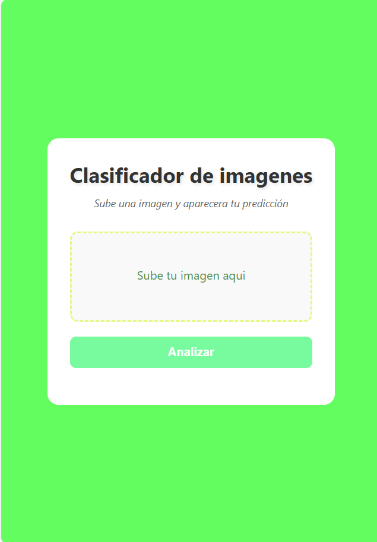
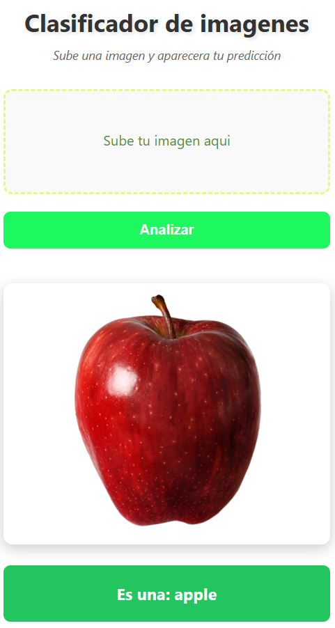

# Clasificador de frutas #
En este proyecto podrás descargar un modelo de clasificación de imágenes y implementar una web donde mi API en app.py que llamará a mi frontend (index.html)
## Requisitos
- Python versión 3.10 o superior
- Extensión para leer Jupyter Notebooks

## Modo de funcionamiento
1. Crear un ````entorno virtual ````
```
    python -m venv venv
    venv\Scripts\activate 
```
2. Instalar ````dependencias````
```
pip install -r requirements.txt 
```

3. Descargar el ````modelo````: Se puede dar al botón de run all 
        
4. Para que la ````API```` funcione:
```
uvicorn app:app 
```

## Vista del Clasificador de imagenes 
### Pantalla principal

### Predicción de imagén



